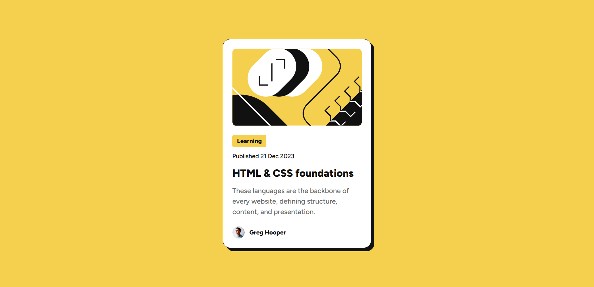
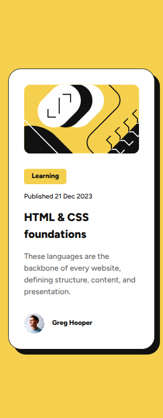

# Frontend Mentor - Blog preview card solution

This is a solution to the [Blog preview card challenge on Frontend Mentor](https://www.frontendmentor.io/challenges/blog-preview-card-ckPaj01IcS). Frontend Mentor challenges help you improve your coding skills by building realistic projects. 

### Screenshot

- Solution URL: [GitHub repo](https://github.com/VasylRosokha/blog-preview-card/)
- Live Site URL: [GitHub pages](https://vasylrosokha.github.io/blog-preview-card/)

### Built with

- Semantic HTML5 markup
- CSS custom properties
- Flexbox
